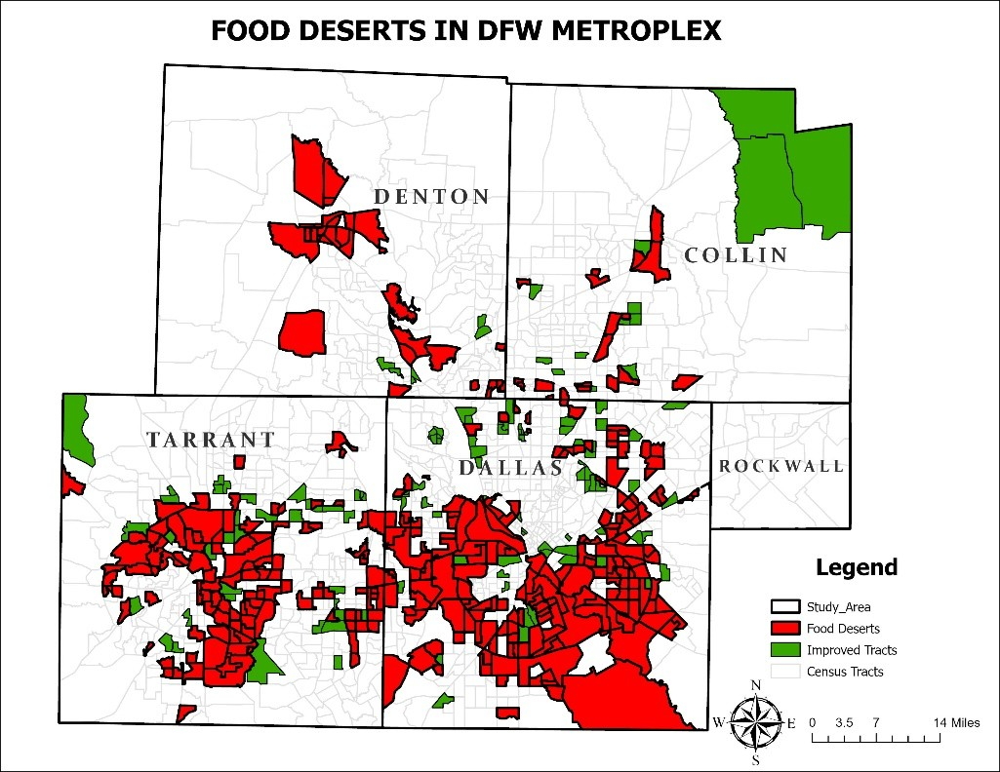
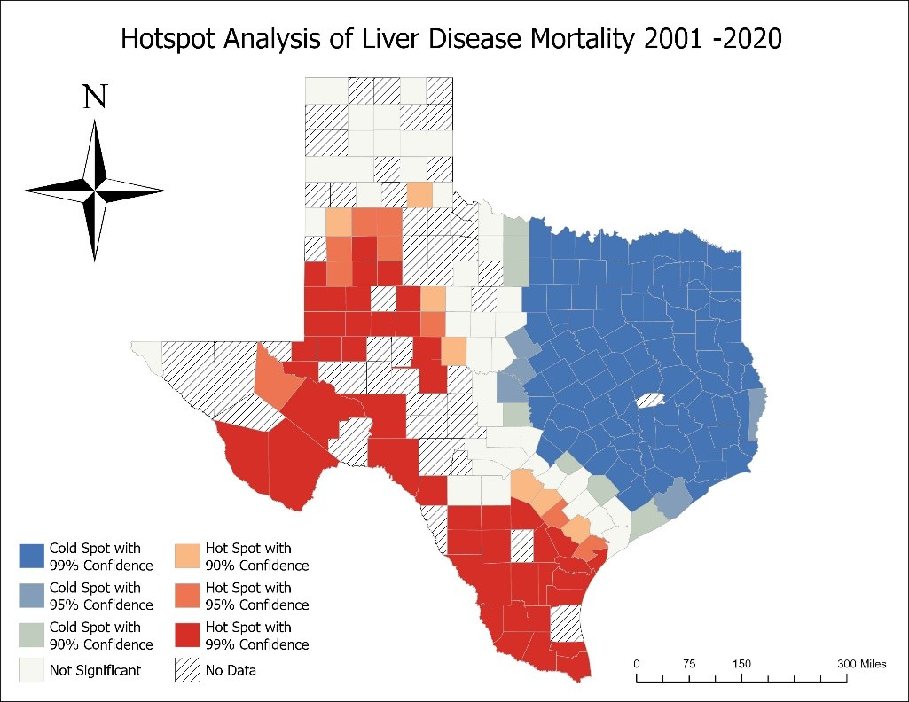

# Nicholas Lawson | GIS Analyst Portfolio

## 👋 About Me

I am **Nicholas Lawson**, a recent Geography graduate with expertise in GIS, spatial analysis, and health geography. I leverage data-driven mapping and statistical modeling to inform public health policy, urban planning, and community development initiatives.

### Core Competencies
- **Software:** ArcGIS Pro, QGIS, Python for GIS
- **Analysis:** Geographically Weighted Regression (GWR), Network Analysis, Hotspot Analysis
- **Specializations:** Health Geography, Urban Planning, LiDAR Processing

- 

---

## 🍎 Project 1: 🌆 Urbanization, Food Security & Spatial Access in DFW

**Challenge:** Despite being part of a major metropolitan region, the urban cores of Dallas and Fort Worth continue to exhibit widespread food insecurity. Paradoxically, areas with high population density and infrastructure are home to some of the region’s most persistent food deserts. Traditional definitions—based solely on proximity to supermarkets—fail to capture the lived realities of these communities, where cultural preferences, mobility limitations, and overlooked food retailers reshape access. This study addresses the spatial mismatch between where people live and where healthy food is truly available.

**Approach:** Comprehensive mapping that includes farmers' markets and ethnic grocery stores alongside traditional supermarkets to provide a more nuanced view of food access.

**Tools Used:** ArcGIS Pro, Network Analyst, USDA SNAP Retailer Locator, CDC PLACES, American Community Survey, Transport Network

**Spatial Analysis:**
- Used Network Analyst to generate 1-mile service areas from food retailers.
- Expanded retailer dataset with ethnic stores and farmers' markets.

**Summary Statistics:**
- Total food retailers: 1,023 (755 supermarkets, 241 small grocers, 27 farmers' markets)
- Census tracts analyzed: 1,536 (1,508 urban, 28 rural)
- Food desert tracts (traditional definition): 1,127
- Food desert tracts (expanded definition): 1,010 (10% reduction)
- Low-income food desert tracts dropped from 385 to 325 (16% reduction)

- **Slideshow:**

  

    
    
    
  

## 🍎 Project 2: Food Deserts and Chronic Disease in DFW: Association vs. Causality

**Objective:**  
Examine the spatial relationship between food desert classification and the prevalence of obesity and diabetes using regression models.

**Approach:**  
Used Geographically Weighted Regression (GWR) to test local associations between food access and chronic disease rates across Dallas-Fort Worth census tracts.

**Statistical Highlights:**
- **Obesity**: R² = 0.52 (significant, p = 0.008)
- **Diabetes**: R² = 0.40 (not significant, p = 0.12)
- Highest coefficients in southern Dallas and western Tarrant Counties

**Factors:**
- Food deserts alone were **not causal predictors** of disease (p > 0.27)
- Stronger predictors included:
  - Age 65+
  - Education level
  - Race/ethnicity (Black and Hispanic)
  - Poverty

**Integrated Model Performance:**
- Obesity model R² = **0.89**
- Diabetes model R² = **0.82**

**Slideshow:**

  

    
    
    
  

**Interpretation:**  
Food access is **associated** with poor health outcomes in specific areas, but **causality** is best explained through a broader social determinants framework. Spatial modeling helps identify where food environments align with health risks, guiding targeted interventions.

---

## 🏥 Project 3: Liver Disease Mortality Patterns in Texas

**Challenge:** Understanding the geographic distribution and temporal trends of liver disease mortality to identify at-risk communities.

**Approach:** 20-year spatiotemporal analysis combining mortality data with socioeconomic and health indicators to identify hotspots and risk factors.

**Tools Used:** ArcGIS Pro, CDC WONDER, County Health Rankings, Geographically Weighted Regression (GWR)

**Spatial Analysis:**
- Hotspot analysis identified persistent high mortality clusters.
- GWR analyzed local relationships between mortality and health/socioeconomic variables.

**Summary Statistics:**
- Counties analyzed: 207
- Significant hotspots: 12 counties in south and west Texas
- Strongest variable correlations:
  - Diabetes (R² = 0.43)
  - Hispanic population (R² = 0.32)
  - Obesity (R² = 0.30)
  - Income (R² = 0.25)
 
    **Slideshow:**

  

    
    
    
  

**Interpretation:**
- Public health risks are spatially clustered and vary regionally.
- Policy focus should be tailored for regions like South Texas where multiple risk factors converge.

---

## 🏗️ Project 3: LiDAR Building Extraction in Waco, TX

**Challenge:** Accurate building inventory and volume estimation for urban planning without costly field surveys.

**Objective:**  
Estimate small-area population using LiDAR-derived building metrics (count, area, volume) across 125 census blocks in Waco, Texas.

**Study Area:**  
Waco, a mid-sized city with 140,000 residents, offers a mix of urban, suburban, and semi-rural environments—ideal for testing population estimation models in transitional landscapes.

**Approach:**  
High-resolution LiDAR data (TNRIS) and 2020 Census block data were integrated using ArcGIS Pro. The methodology included:
- Generation of DSM, DTM, and DHM
- Building extraction (threshold > 2.2m)
- Binary mask filtering and footprint vectorization
- Calculation of count, area, and volume metrics
- Population estimation using OLS regression models

**Model Results:**

| Model | Metric Used       | R²      | Pop. Estimate | Error (%)     |
|-------|-------------------|---------|---------------|----------------|
| 1     | Building Count    | 0.6259  | 5,713.01      | +0.0001%       |
| 2     | Building Area     | 0.5815  | 5,709.54      | −0.06%         |
| 3     | Building Volume   | 0.1635  | 5,656.80      | −0.98%         |

**Key Takeaways:**
- **Building count** was the most accurate and interpretable metric for population estimation in Waco’s mixed-density environment.
- **Volume** was the weakest predictor due to the influence of non-residential or tall commercial buildings.
- Results align with literature emphasizing building count and area as effective proxies in semi-urban contexts.

**Implications:**
- Supports scalable LiDAR methods for urban planning, emergency response, and infrastructure management.
- Future work should incorporate land-use data, socio-demographic context, or machine learning for improved precision.

## 📈 Technical Skills

**GIS & Spatial Analysis**
- Advanced cartography and spatial modeling
- Network analysis and service area optimization  
- Regression, clustering, and spatial statistics
- Remote sensing and classification

**Programming & Data**
- Python (ArcPy, Pandas, GeoPandas)
- SQL for spatial databases
- SPSS
- Web mapping: ArcGIS Pro, ArcGIS Online

**Professional Experience**
- Project design, research, and execution
- Data visualization and report writing
- Public presentations and stakeholder engagement

---

## 🎓 Education & Certifications

**Master of Science in Geography**  
_University of North Texas, 2025_  
_Concentration: Geographic Information Systems & Health and Medical Geography_

**Bachelor of Art in Geography and Resource Development**  
_University of Ghana, 2018_  
_Concentration: Geographic Information Systems,  Cities and Urbanisation, Transportation_

**Relevant Coursework**
- Advanced GIS Analysis
- Health Geography  
- Urban Planning
- Spatial Statistics
 

---

## 📞 Let's Connect

I'm actively seeking opportunities in GIS analysis, urban planning, and public health research. Let's discuss how spatial analysis can drive better decision-making in your organization.

📧 **Email:** nickklas96@gmail.com  
💼 **LinkedIn:** (https://www.linkedin.com/in/nicholas-lawson-a3b861b6/) 
💻 **GitHub:** [cwecu](https://github.com/cwecu)  
📍 **Location:** Dallas-Fort Worth, Texas

---

*Portfolio last updated: June 2025*
"""

