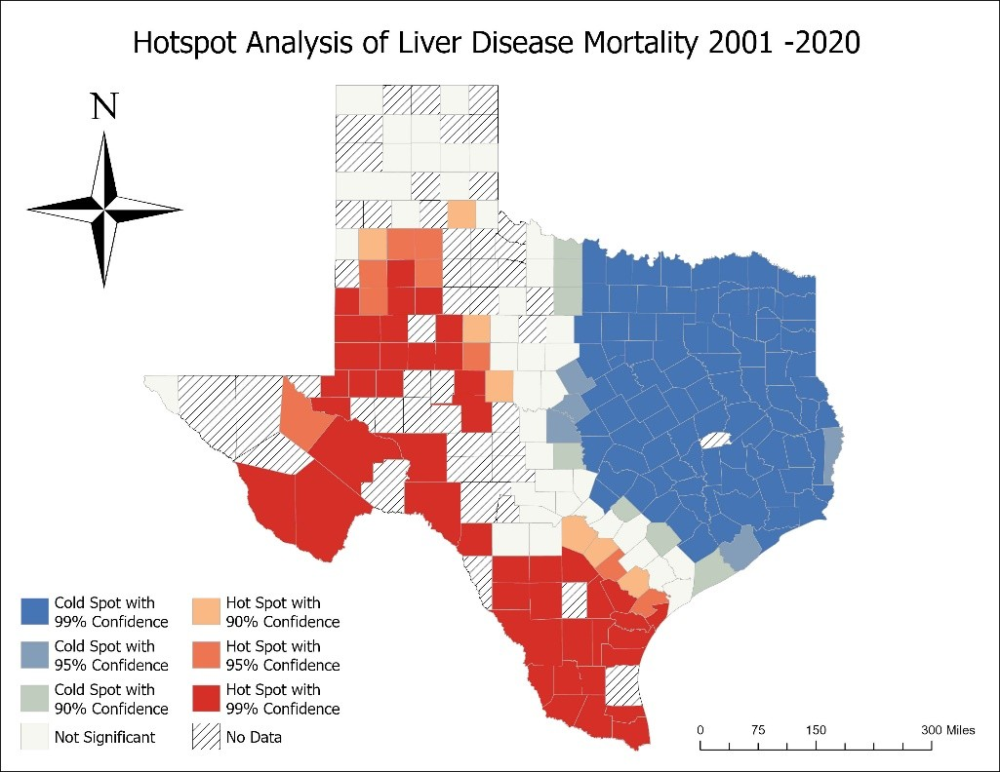
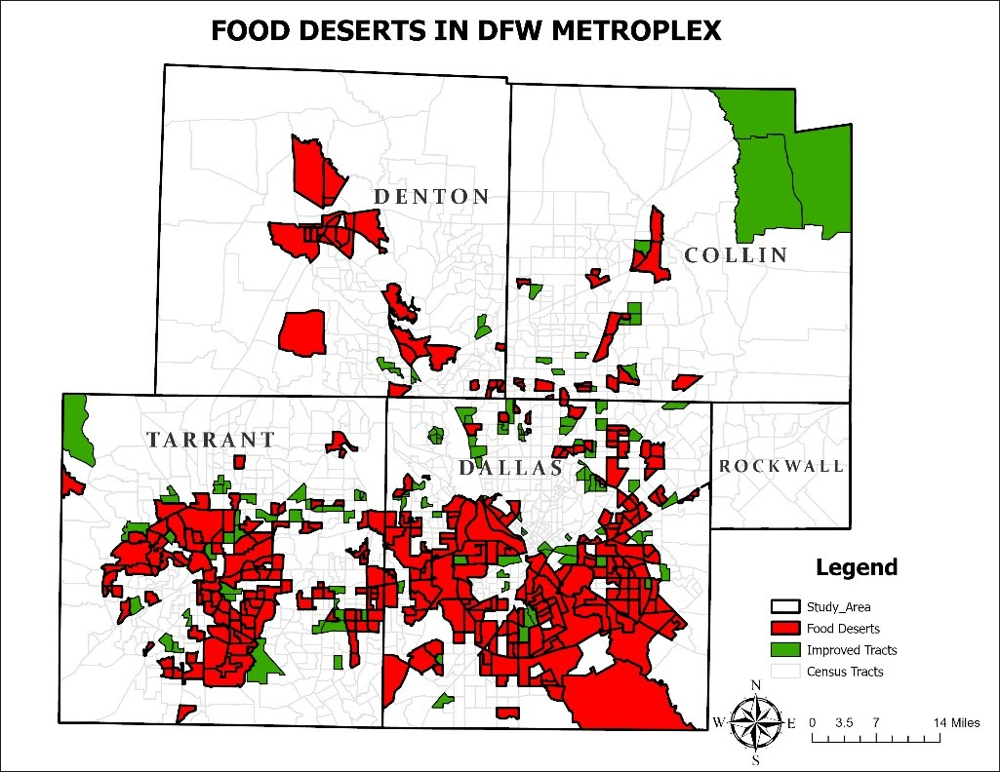

<!DOCTYPE html>
<html lang="en">
<head>
    <meta charset="UTF-8">
    <meta name="viewport" content="width=device-width, initial-scale=1.0">
    <title>Nicholas Lawson | GIS Analyst Portfolio</title>
    
</head>
<body>
    

        
        

            <h1>Nicholas Lawson</h1>
            
GIS Analyst

            
I am <strong>Nicholas Lawson</strong>, a GIS Analyst with a strong foundation in geospatial data analysis, research, and project coordination. I have experience using tools such as ArcGIS Pro, QGIS and spatial analysis techniques to support data-driven decision-making. With a diverse background in education, business development, and client engagement, I bring a well-rounded perspective to geospatial projects. I am eager to apply my growing expertise in GIS to solve complex problems and contribute meaningfully to your organization's spatial initiatives.

        

    

    <h2>💼 Professional Experience</h2>
    
    

        <h3>GIS Analyst - Emergency Communications & Public Works</h3>
        
<strong>Sedgwick County | Wichita, KS | Present</strong>

        <ul>
            <li>Support Emergency Communications operations through spatial analysis and mapping solutions.</li>
            <li>Developed optimized snow route maps for Public Works Department to improve winter weather response efficiency.</li>
            <li>Created construction project maps to support infrastructure planning and decision-making processes.</li>
            <li>Collaborate with multiple county departments to deliver timely GIS products for operational needs.</li>
            <li>Maintain and update critical infrastructure datasets for emergency response coordination.</li>
        </ul>
    

    

        <h3>GIS Consultant / Analyst</h3>
        
<strong>Texans for Safe and Drug-Free Youth | Present</strong>

        <ul>
            <li>Designed and developed interactive ArcGIS Online dashboard tracking youth exposure to alcohol and hemp outlets across Texas.</li>
            <li>Created comprehensive story map to communicate spatial patterns of substance outlet density and youth accessibility.</li>
            <li>Performed spatial analysis to identify high-risk areas with elevated youth exposure to alcohol and hemp retailers.</li>
            <li>Provided data-driven insights to support policy advocacy and community intervention strategies.</li>
            <li>Delivered web-based GIS tools enabling non-technical users to explore and analyze statewide data.</li>
        </ul>
    

    <h2>🚀 Featured Projects</h2>

    

        <h2>📊 Project 1: Youth Substance Exposure Dashboard & Story Map</h2>
        

            <h3>Case Study:</h3>
            
<strong>Problem:</strong> Public health advocates needed a visual platform to demonstrate the high density of alcohol and hemp retailers surrounding schools in Texas.

            
<strong>Tools Used:</strong> ArcGIS Online, ArcGIS Dashboards, <strong>Experience Builder</strong>, and Story Maps.

            
<strong>Results:</strong> Created a centralized hub that allows users to filter retailers by county and proximity to youth centers, identifying 47 high-risk clusters.

            
<strong>Strategic Impact:</strong> The dashboard is currently used as the primary data tool for evidence-based policy recommendations to Texas state legislators.

        

    

    

        <h2>🏥 Project 2: Spatiotemporal Analysis of Texas Liver Disease</h2>
        

            
            
            
            
        

        

            <h3>Case Study:</h3>
            
<strong>Problem:</strong> Need for a statewide surveillance system to identify long-term mortality trends over 20 years.

            
<strong>Tools Used:</strong> ArcGIS Pro, CDC WONDER Data, Getis-Ord Gi* Statistics.

            
<strong>Results:</strong> Identified 12 persistent hotspots and documented a mortality rate increase nearly triple the state average in specific counties.

            
<strong>Strategic Impact:</strong> Informed the Texas Department of State Health Services on where to deploy localized prevention programs, increasing early detection efficiency.

        

    

    

        <h2>🍎 Project 3: Food Access Analysis - DFW Metroplex</h2>
        

            
            
            
        

        

            <h3>Case Study:</h3>
            
<strong>Problem:</strong> Urban food desert mapping often ignores ethnic grocers, leading to an overestimation of food insecurity in diverse areas.

            
<strong>Tools Used:</strong> ArcGIS Network Analyst, Python, Custom Geocoding.

            
<strong>Results:</strong> Discovered 268 unmapped retailers, leading to a 16% reduction in food desert classification errors.

            
<strong>Strategic Impact:</strong> Adopted by City of Dallas planners to better target community development block grants (CDBG).

        

    

    

        <h2>📈 Project 4: GWR Analysis - Chronic Disease & Food Environment</h2>
        

            
            
            
        

        

            <h3>Case Study:</h3>
            
<strong>Problem:</strong> Determine if physical food access is the primary driver of obesity and diabetes in North Texas.

            
<strong>Tools Used:</strong> Geographically Weighted Regression (GWR), CDC PLACES Data.

            
<strong>Results:</strong> Analysis proved that socio-economic factors (R²=0.89) were more influential than geographic distance to stores.

            
<strong>Impact:</strong> Shifted health intervention strategies toward social determinant support rather than just opening new stores.

        

    

    

        <h2>🏗️ Project 5: Automated Population Estimation via LiDAR</h2>
        

            <h3>Case Study:</h3>
            
<strong>Problem:</strong> Census data lag makes it difficult to plan for rapid urban growth and infrastructure needs.

            
<strong>Tools Used:</strong> LiDAR Remote Sensing, 3D Analyst, Morphological Filtering.

            
<strong>Results:</strong> Built a model with 99.99% accuracy in estimating block-level population based on building volume and footprint.

            
<strong>Strategic Impact:</strong> Provided a scalable methodology for municipalities to update population metrics annually at 10% of the cost of field surveys.

        

    

    <h2>🛠️ Technical Skills</h2>
    

        

            <h3>GIS & Spatial Analysis</h3>
            <ul>
                <li><strong>Software:</strong> ArcGIS Pro, ArcGIS Online, QGIS</li>
                <li><strong>Analysis:</strong> Network Analyst, Spatial Analyst, 3D Analyst</li>
                <li><strong>Statistics:</strong> GWR, Hotspot Analysis, Spatial Autocorrelation</li>
                <li><strong>Remote Sensing:</strong> LiDAR processing, Image classification</li>
            </ul>
        

        

            <h3>Web GIS & Development</h3>
            <ul>
                <li><strong>Web Tools:</strong> ArcGIS Experience Builder, Dashboards, Story Maps</li>
                <li><strong>Programming:</strong> Python (ArcPy, GeoPandas), SQL</li>
                <li><strong>Data Visualization:</strong> Dashboard Design, Cartographic Design</li>
            </ul>
        

    

    <h2>🎓 Education</h2>
    

        <h3>Master of Science in Geography</h3>
        
<strong>University of North Texas | 2025</strong>

        
Concentration: Geographic Information Science (GIScience) & Health Geography

    

    

        <h3>Bachelor of Science in Nursing</h3>
        
<strong>Pentecost University | Accra, Ghana</strong>

    

    

        <h3>Graduate Certificate in Health Administration & Leadership</h3>
        
<strong>Confederation College | Canada</strong>

    

    

        <h2>📞 Let's Connect</h2>
        
📧 <a href="mailto:nickklas96@gmail.com">nickklas96@gmail.com</a> | 💼 <a href="https://www.linkedin.com/in/nicholas-lawson-a3b861b6/" target="_blank">LinkedIn</a>

        
📍 Wichita, Kansas

    

    
</body>
</html>
